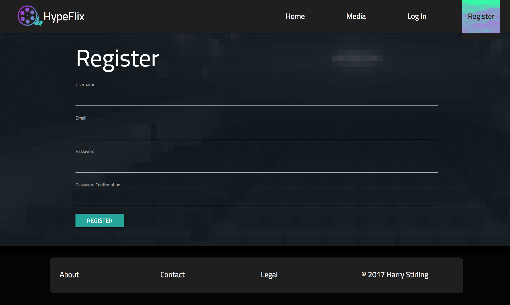

# WDI-Project-2

#User Overview

HypeFlix is a film & tv-show site that combines the IMDb database with a reddit themed voting system that allows you and your friends to post and comment on what you're most hyped about.

The homepage (below) is an intractable and automatic carousel that displays all of the media library and you can up or down vote without leaving home. 

 

Media home is a static display of all the media that has been indexed and is descendingly sorted from it's Hype Score. 

 
 
Adding media on HypeFlix is really simple and just requires the user to enter the title and the auto-fill will retrive the rest. 
 
 

Registering for HypeFlix is quick and once logged in you have access to the add + edit actions & vote functions. 

 

#Planning Overview

Prior to the build I made a few slides to get an idea of how I was actually going to display the site and although slightly different from my final product it helped me all the same to begin a mental checklist of steps I'd need to do to get it done.

 

#Code Overview

**Backend:** MEN (Mongo-Express-Node) stack app. 

**Front:** jQuery, ES6, HTML5, SCSS, Materialize CSS were used to create and style this app.

#Review
I really enjoyed consolidating my learning on this project and am pleased with the final product. 

I found aspects e.g. making a RESTful resource & storing the score via AJAX a bit challenging but through reading documentation and familiarity over time I understood their route.

**Further Objectives**

I'd really like to build out a profile section + group function into the app so you can specifically share and add media with your friends.

#Acknowledgements

My GA instructors
